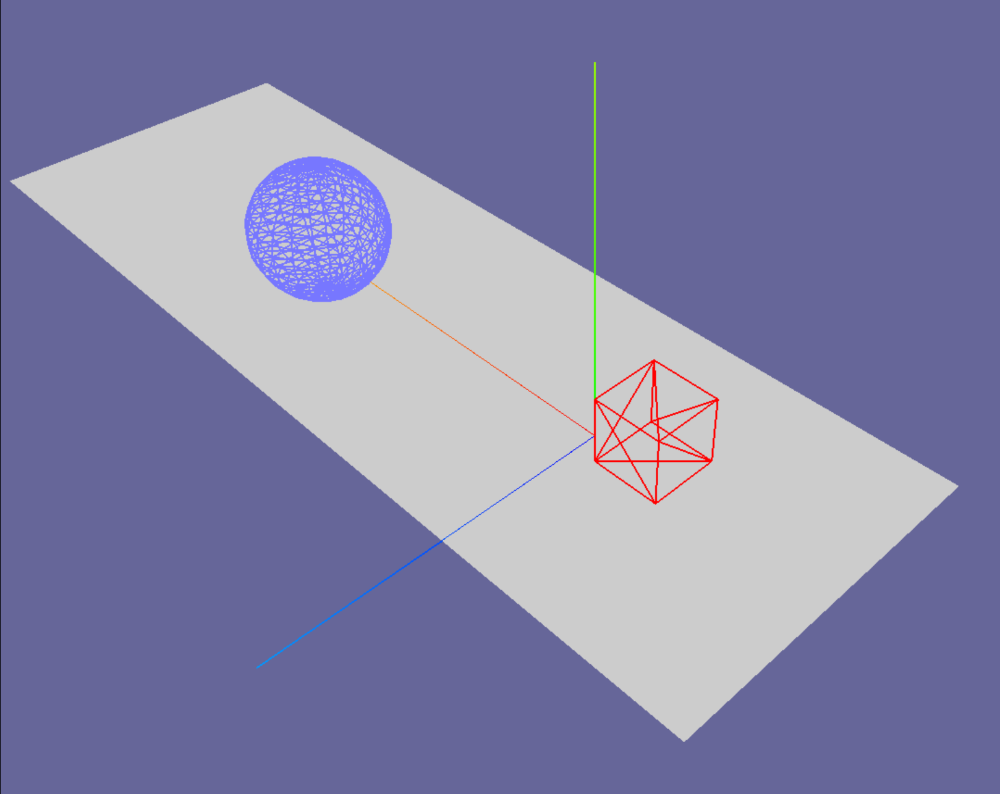

# Three/Qt
yet another C++ port of three.js, based on Three.js r86+ and a few of the Qt framework's OpenGL classes

Also comes with an integration into QML (aka QtQuick) in the form of a QML item

Currently in early alpha state. Code has largely been ported, and a first simple example program can be executed.

Contributors welcome anytime

