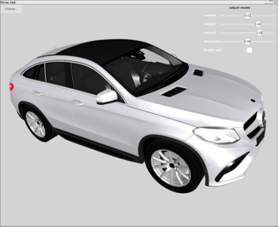

# Three::pp
another C++ port of Three.js, based on Three.js r86+ and a few of the Qt framework's OpenGL classes

May be used standalone (limited work required to remove the dependency on Qt's QOpenGLFunctions), or through the extensive QML (aka QtQuick) integration.

Currently in beta state. Some examples demonstrate the functionality. Buildable under Linux/gcc 7.3 and sometimes under Android. Windows available soon.

Contributors welcome

## Some Samples (more in the code base)
simple geometries with ambient light, spot light and shade:

 

Environment Maps

Model Loading (3DS model through Assimp)

