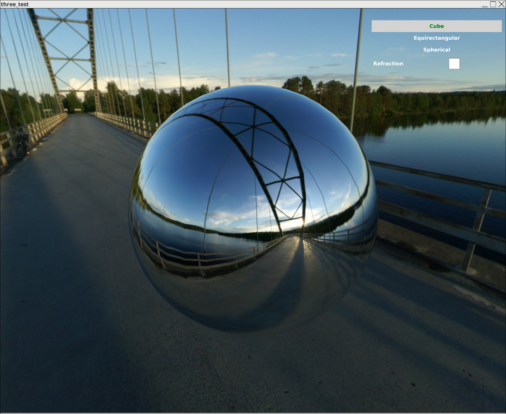
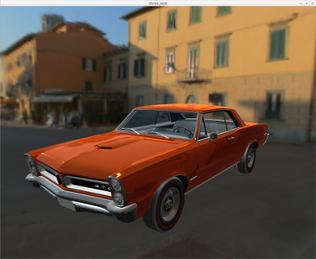

# Three::pp
C++ port of Three.js, based on Three.js r86+ and a few of the Qt framework's OpenGL classes

Three::pp can be used directly as a C++ API that parallels Three.js's Javascript, or through the extensive QML (aka QtQuick) integration. The examples are mostly in QML

For the plain C++ API, a slight dependency on Qt remains (mostly convenience classes like QImage and OpenGLFunctions) which could be removed with limited effort.

Currently in beta state. A number of examples demonstrate the functionality. Buildable under Linux/gcc 7.3 and sometimes under Android. Windows available soon.

Contributors welcome

## Some Samples (more in the code base)
simple geometries with ambient light, spot light and shade:

 

Environment Maps

Model loading (3DS model through Assimp) and postprocessing (apply environment map)

